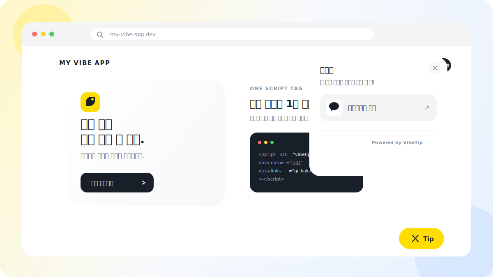

# VibeTip

**바이브 코딩으로 만든 앱에 1분 만에 후원 버튼 달기.**

모바일에서는 카카오페이 송금 화면을 열고, PC에서는 휴대폰으로 스캔할 QR을 보여줍니다.

<p align="center">
  
</p>

<p align="center">
  <a href="https://vibetip-demo.vercel.app/"><strong>▶ 라이브 데모</strong></a> — PC에서는 QR, 모바일에서는 카카오페이 송금 화면이 열립니다.
</p>

## 빠른 시작

> **유저가 할 일은 딱 하나 — 카카오페이 송금코드 URL을 넣는 것뿐입니다.**
>
> 1. 카카오톡/카카오페이에서 내 **송금코드**를 열어 `https://qr.kakaopay.com/...` 링크를 복사합니다 ([발급 방법](./docs/KOREA.md)).
> 2. 아래 예제의 `data-links`(스크립트 태그) 또는 `links`(npm)에 그 URL만 바꿔 넣습니다.
> 3. 끝입니다 — 모바일에서는 송금 화면이 열리고, PC에서는 QR이 자동으로 표시됩니다.

### 스크립트 태그

```html
<script
  src="https://cdn.jsdelivr.net/npm/vibetip@0/dist/vibetip.iife.js"
  data-name="홍길동"
  data-message="이 앱이 도움이 됐다면 커피 한 잔!"
  data-links="https://qr.kakaopay.com/your-code"
></script>
```

본인의 카카오페이 송금코드 URL만 넣으면 됩니다.

### npm

```bash
npm install vibetip
```

```ts
import { init } from "vibetip";

const tip = init({
  name: "홍길동",
  message: "이 앱이 도움이 됐다면 커피 한 잔!",
  links: ["https://qr.kakaopay.com/your-code"],
  accent: "#FFDD00",
  position: "bottom-right", // or 'bottom-left'
  theme: "auto", // 'light' | 'dark' | 'auto'
});
// tip.open() / tip.close() / tip.destroy()
```

React/Next.js 사용법은 [examples/](./examples)를 보세요.

## 카카오페이 송금코드 준비

카카오톡에서 송금코드를 발급하고 URL을 확인하는 방법은 **[한국 크리에이터 가이드](./docs/KOREA.md)** 를 보세요.

현재 VibeTip은 `qr.kakaopay.com`과 `link.kakaopay.com` 카카오페이 송금 링크만 지원합니다. 다른 URL을 전달하면 초기화 시 명확한 오류를 반환합니다.

## 옵션

| 옵션           | 타입                              | 기본값           | 설명                            |
| -------------- | --------------------------------- | ---------------- | ------------------------------- |
| `links`        | `(string \| TipLink)[]`           | **필수**         | 카카오페이 송금 링크 목록       |
| `name`         | `string`                          | –                | 패널 헤더에 표시할 이름         |
| `message`      | `string`                          | 기본 한국어 문구 | 헤더 아래 메시지                |
| `accent`       | `string`                          | `#FFDD00`        | 플로팅 버튼 색                  |
| `position`     | `'bottom-right' \| 'bottom-left'` | `bottom-right`   | 플로팅 버튼 위치                |
| `mount`        | `string \| HTMLElement`           | –                | 지정 시 플로팅 대신 해당 요소 안에 인라인 카드로 렌더링 (푸터·사이드바 등 자유 배치) |
| `theme`        | `'light' \| 'dark' \| 'auto'`     | `auto`           | 패널 색상 모드                  |
| `buttonLabel`  | `string`                          | `Tip`            | 버튼 텍스트 (`''`이면 아이콘만) |
| `hideBranding` | `boolean`                         | `false`          | Powered by 푸터 숨김            |

`init()`은 `{ open, close, destroy }`를 반환합니다. SPA에서는 언마운트 시 `destroy()`를 호출하세요.

플로팅이 싫다면 인라인으로:

```html
<div id="tip-here"></div>
<script>
  VibeTip.init({ links: ['https://qr.kakaopay.com/your-code'], mount: '#tip-here' })
</script>
```

스크립트 태그 자동 초기화에서는 `data-mount="#tip-here"` 속성으로 동일하게 동작합니다.

## Examples

[`examples/`](./examples)에 복사해서 바로 쓸 수 있는 예제가 있습니다:

- [`vanilla/`](./examples/vanilla) — 스크립트 태그 한 줄, 빌드 없음
- [`react-vite/`](./examples/react-vite) — React `useEffect` 마운트/언마운트 패턴
- [`nextjs/`](./examples/nextjs) — App Router `'use client'` SSR-안전 패턴

## 특징

- gzip 기준 **~10KB**, 런타임 의존성 0개, 클릭 전까지 추가 네트워크 요청 0회
- Shadow DOM — 여러분 앱의 CSS와 절대 충돌하지 않음
- 추적 없음, 쿠키 없음, iframe 없음, 결제 비중개 — 그냥 링크
- 진짜 `<button>`, `aria-expanded`, Escape 닫기, 포커스 복귀, `prefers-reduced-motion` 지원

## 철학

- **송금을 중개하지 않습니다.** VibeTip은 UI일 뿐, 돈은 송금자와 카카오페이 사이에서만 움직입니다. VibeTip 수수료도, 서드파티 iframe도 없습니다.
- **바이브 코더 친화.** AI에게 "VibeTip 붙여줘"라고 하면 끝나는 수준의 단순함이 목표입니다.

## 개발 & 릴리즈

[Bun](https://bun.com)으로 개발합니다.

```bash
bun install
bun run build     # tsc 타입체크 + Bun 번들러 + .d.ts 생성
bun run dev       # 소스 변경 시 자동 재빌드
open demo/index.html
```

릴리즈는 [changesets](https://github.com/changesets/changesets)로 자동화되어 있습니다. 변경 PR에 `bun changeset`으로 변경 요약을 함께 커밋하면, main 머지 시 Version Packages PR이 생성되고 그 PR을 머지하면 npm에 자동 배포됩니다. 빌드는 Bun으로 하지만, 게시는 `changeset publish`가 `npm publish`로 위임해 OIDC trusted publishing + provenance를 그대로 사용합니다.

## License

MIT
